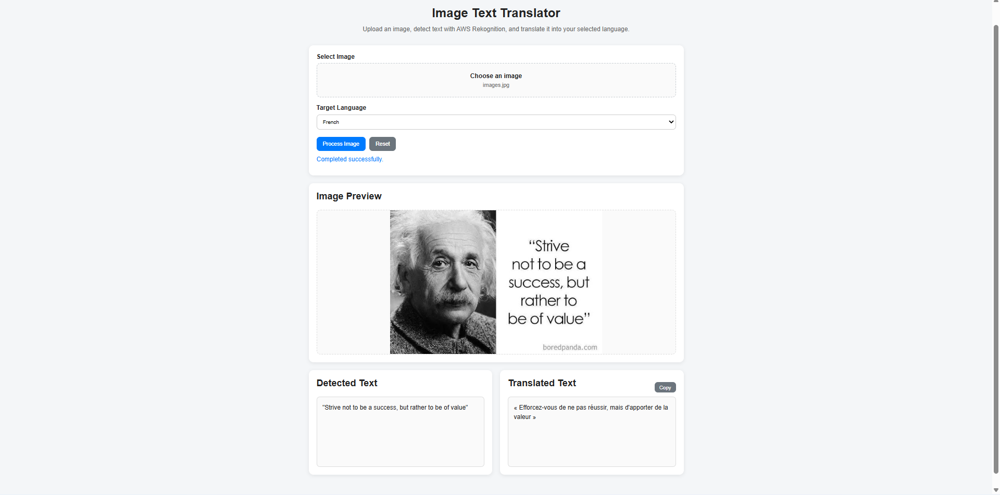

# Image Text Translator

A cloud-based image text translation application built with Python, Flask, and AWS services. The application uploads images to Amazon S3, detects text using Amazon Rekognition, and translates the detected text into a selected target language using Amazon Translate.

## Demo


## Features

* Upload images through a web interface
* Store uploaded images in Amazon S3
* Detect text in images using Amazon Rekognition
* Translate detected text using Amazon Translate
* Support multiple target languages
* REST API backend built with Flask
* Modular AWS service architecture
* Input validation and error handling

## Tech Stack

### Backend

* Python
* Flask
* Boto3
* Amazon S3
* Amazon Rekognition
* Amazon Translate

### Frontend

* JavaScript
* Vite

## Architecture

```text
Web Interface
     |
     v
Flask REST API
     |
     +----> Amazon S3
     |        |
     |        v
     +----> Amazon Rekognition
     |        |
     |        v
     +----> Amazon Translate
              |
              v
       Translation Result
```

## Project Structure

```text
image-text-translator/
├── backend/
│   ├── services/
│   │   ├── storage_service.py
│   │   ├── recognition_service.py
│   │   └── translation_service.py
│   ├── tests/
│   ├── data/
│   │   └── uploads/
│   └── app.py
│
├── frontend/
│   └── src/
│
├── requirements.txt
└── README.md
```

## Installation

### Backend

Create and activate a virtual environment, then install the required Python packages:

```bash
python -m venv .venv
pip install -r requirements.txt
```

### Frontend

```bash
cd frontend
npm install
```

## AWS Configuration

The application requires AWS credentials with access to Amazon S3, Rekognition, and Translate.

Create a `.env` file for your local AWS configuration and make sure `.env` is excluded from Git.

Example:

```text
AWS_ACCESS_KEY_ID=your_access_key
AWS_SECRET_ACCESS_KEY=your_secret_key
AWS_REGION=your_region
S3_BUCKET_NAME=your_bucket_name
```

## Running the Application

Start the Flask backend:

```bash
python backend/app.py
```

The backend runs at:

```text
http://127.0.0.1:5000
```

In another terminal, start the frontend:

```bash
cd frontend
npm run dev
```

The frontend runs at:

```text
http://localhost:5173
```

## How It Works

1. The user selects and uploads an image.
2. The Flask backend validates the image and uploads it to Amazon S3.
3. Amazon Rekognition detects text contained in the uploaded image.
4. The detected text is sent to Amazon Translate.
5. The translated result is returned through the API and displayed to the user.